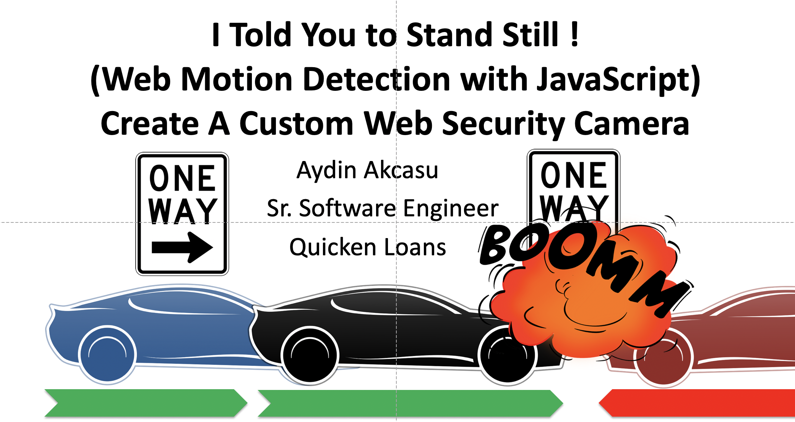

# WebComputerVision

Web browsers are getting more and more powerful. Now you can easily access the camera, and analyze the images.

Using only a browser, we will access the camera , using WebRTC (Web Real-Time Communications).

This code will capture still frames from the streaming video, and analyze the images and create a Motion Detection Web Application, using ONLY JavaScript.

The web app that will detect if there is motion, the direction, and the magnitude.

Demos:

* [Intro](https://aydinakcasu.github.io/WebComputerVision/Demo%200%20-%20Intro.html)
* [Basic Capture](https://aydinakcasu.github.io/WebComputerVision/Demo%201%20-%20Basic%20Capture.html)
* [Image Capture - Dim](https://aydinakcasu.github.io/WebComputerVision/Demo%202%20-%20Image%20Capture%20-%20Dim.html)
* [Image Capture - Gray](https://aydinakcasu.github.io/WebComputerVision/Demo%202%20-%20Image%20Capture%20-%20Gray.html)
* [Image Capture - Green](https://aydinakcasu.github.io/WebComputerVision/Demo%202%20-%20Image%20Capture%20-%20Green.html)
* [Image Capture - Red](https://aydinakcasu.github.io/WebComputerVision/Demo%202%20-%20Image%20Capture%20-%20Red.html)
* [Image Capture - Negative](https://aydinakcasu.github.io/WebComputerVision/Demo%202%20-%20Image%20Capture%20-%20Negative.html)
* [Image Difference](https://aydinakcasu.github.io/WebComputerVision/Demo%203%20-%20Image%20Difference.html)
* [Final](https://aydinakcasu.github.io/WebComputerVision/Demo%209%20-%20Final.html)

Presentation:
* [Slides](https://aydinakcasu.github.io/WebComputerVision/docs/2019_07_18_KCDC_ChromeCamera.pdf)

For more information, please contact:
* aakcasu@gmail.com
